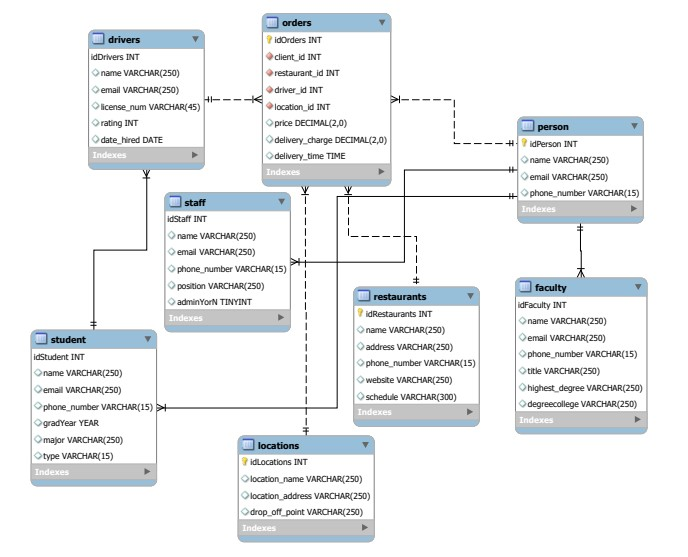
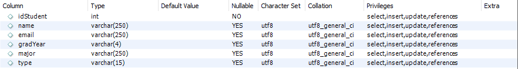

# ITCS 3160 Project
Member: Adona Mwense
# Introduction
In light of events affecting the student mobility on campus, universities are working to see if they should have their own deliveries services to prevent the stream of individuals who have no ties to the university. Thus, ensuring authorized university employees are the only ones delivering food on campus for safety and health reasons. Given certain requirement, I design a fully normalized database system using business rules, entity relationship diagramming, normalization and schema design modeling this system.
# Use Case
A registered client (Student, Faculty or Staff) can make an order and pays for it. A restaurant can receive an order, confirm it an prepare the order. Then the driver (Student) pick us the prepared order and delivers it to the client. And to finish the client rates the driver.

# Business Rules
-Persons (campus faculty, staff, students) have accounts in the system.

-Locations are spots on campus where food can be delivered.

-Persons can also be drivers (delivery personnel which have to be approved). 

-All delivery personnel are students.

-There are 8 initial delivery drivers.

-There is a flat fee of $5 for each delivery.

-A person orders food many times.

-An individual delivery is tied to only one person for the order.

-The order is for only one restaurant.  

 
# EERD

## Data Dictionary

Person

Faculty

Staff

Student

Driver

Location

Order

Restaurant

# MySQL Queries
# Trigger
# Stored Procedure
# Future Work
# MySQL Dump
Campus_Food_Delivery_Service.sql
npx embedme README.md
